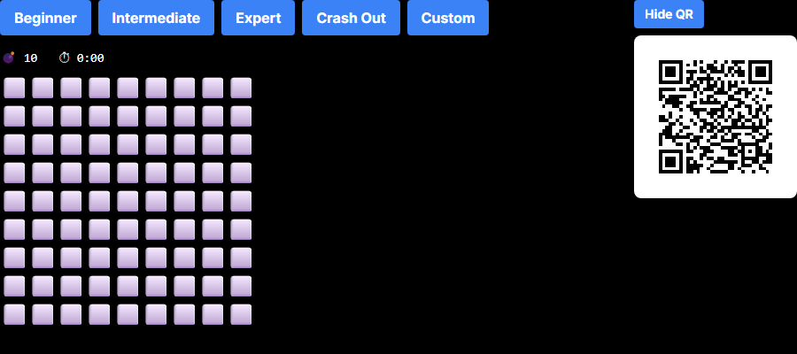
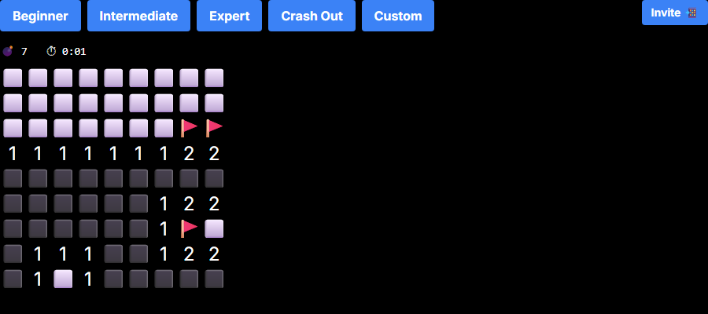
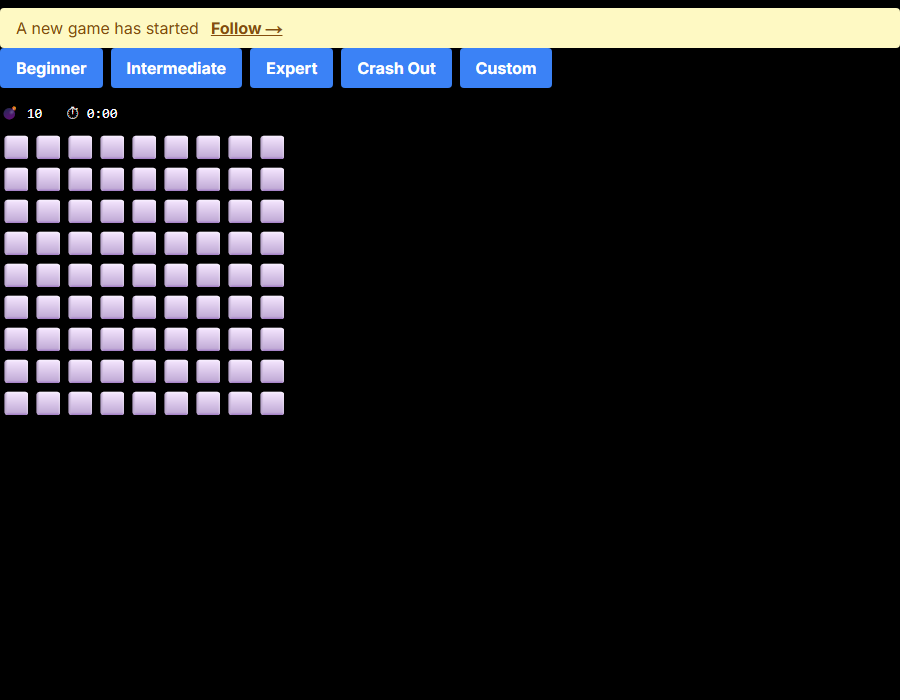
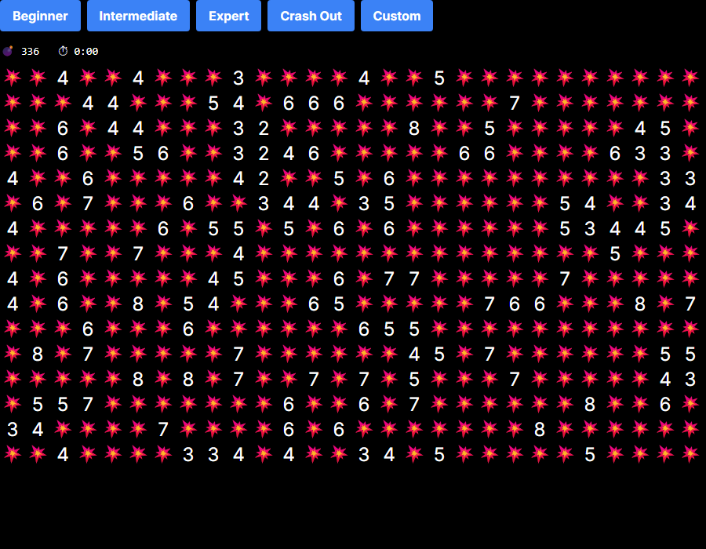

# Minesweeper Multiplayer

Co-op multiplayer Minesweeper. Share a room URL and play together — everyone sees the same board in real time.

## Screenshots

**Fresh board**


**Mid-game** — cleared region, numbered border, flags on deduced mines


**Multiplayer: follow notification** — when a player starts a new game, others see a banner


**Game over** — Crash Out mode (70% mine density)


## Difficulty modes

| Mode | Grid | Mines |
|------|------|-------|
| Beginner | 9×9 | 10 |
| Intermediate | 16×16 | 40 |
| Expert | 16×30 | 99 |
| Crash Out | 16×30 | 336 (~70%) |
| Custom | any | any |

Crash Out mode designed by Jude Wallace.

## Local development

**Prerequisites:** Docker (for the local Supabase stack)

### 1. Start the local Supabase stack

```bash
npx supabase start
```

This starts Postgres, PostgREST, and the Realtime server via Docker. It applies migrations automatically on first run. The local API is at `http://127.0.0.1:54321`.

`.env.local` is already configured for this local stack — no changes needed.

### 2. Start the app

```bash
npm install
npm run dev
```

Open [http://localhost:3000](http://localhost:3000).

### 3. Stop the local stack

```bash
npx supabase stop
```

## Regenerating screenshots

With the dev server running:

```bash
npx playwright test scripts/screenshots.spec.ts
```

## Schema changes

Add a new migration file under `supabase/migrations/` and restart (or run `npx supabase db reset` to reapply all migrations).

## Deploying

Point `NEXT_PUBLIC_SUPABASE_URL` and `NEXT_PUBLIC_SUPABASE_ANON_KEY` at your Supabase project. Apply the migrations via the Supabase dashboard or CLI (`npx supabase db push`). Deploy the Next.js app anywhere (e.g. Vercel).
